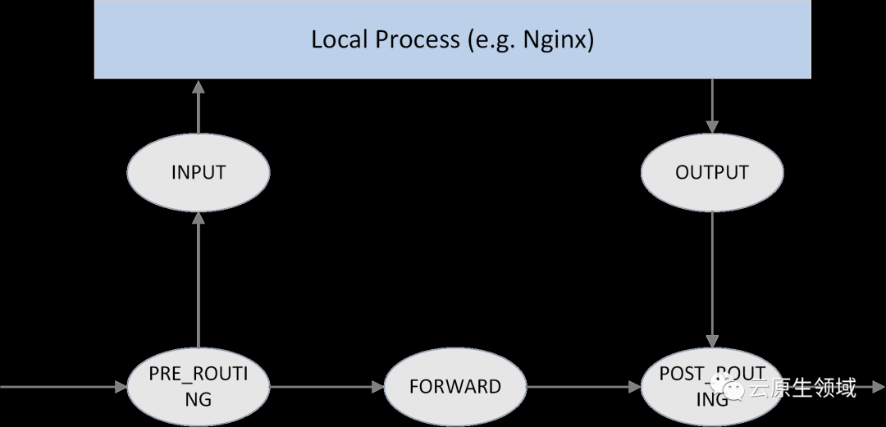

# Cilium eBPF 

Cilium 通过内核的能力实现kube-proxy的功能，这点不同于iptables和netfilter体系结构。

在 netfilter 框架中有5个钩子

Cilium是未来可期的CNI插件，目前商用且掌握的并不多。短期看还是使用IPVS，调研Cilium。

以下文章可以参考：

[利用 eBPF 支撑大规模 K8s Service](https://mp.weixin.qq.com/s/TdSOHk5EnSBer8uG5vqNyg)

[(译)深入理解 Kubernetes 网络模型 - 自己实现 kube-proxy 的功能](https://mp.weixin.qq.com/s/zWH5gAWpeAGie9hMrGscEg)

[{译}深入理解 Cilium 的 eBPF 收发包路径（datapath）（KubeCon, 2019）](http://arthurchiao.art/blog/understanding-ebpf-datapath-in-cilium-zh/?hmsr=toutiao.io&utm_medium=toutiao.io&utm_source=toutiao.io)

[Linux 数据包跟踪工具 -- Perf/eBPF](https://mp.weixin.qq.com/s/PTxcT9aqL5lKKZB1cG_WxA)

[Cilium：基于 BPF/XDP 实现 K8s Service 负载均衡](https://mp.weixin.qq.com/s/m7ZVM5bc4N7FnzR_nhqD-g)